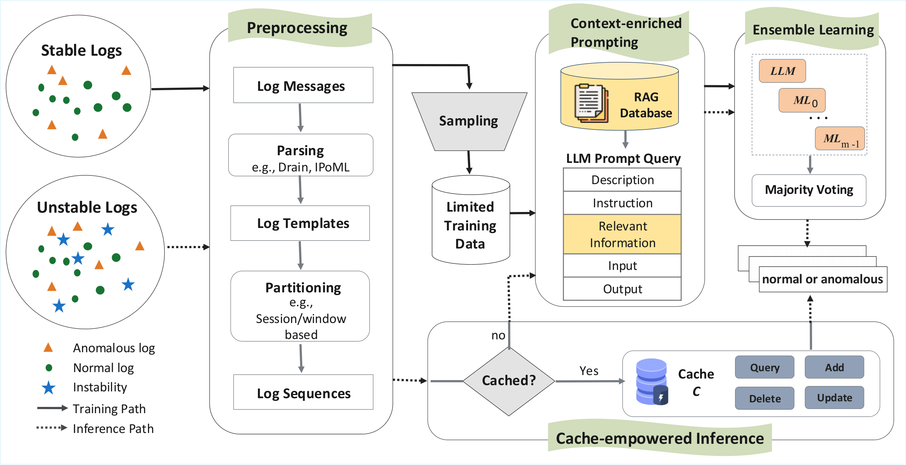

# LLM meets ML: Data-efficient Anomaly Detection on Unstable Logs

Welcome to the repository for the research paper "LLM meets ML: Data-efficient Anomaly Detection on Unstable Logs." This package aims to facilitate the replication of our studies, made available to reviewers. We plan to make it publicly available  under a suitable license upon acceptance to encourage further research and comparison in the field of unstable log anomaly detection.

## Authors
- Fatemeh Hadadi (fhada072@uottawa.ca)
- Qinghua Xu (qinghua.xu@ul.ie)
- Domenico Bianculli (domenico.bianculli@uni.lu)
- Lionel Briand (lbriand@uottawa.ca)

## Overview
### Introduction
<p align="center">

</p>
Log-based anomaly detection has been widely studied in the literature as a way to increase the dependability of software-intensive systems. Though most existing methods operate under a closed-world assumption, where logs remain stable in terms of structure and content, in reality, logs can be unstable due to changes in the software or the environment. Anomaly detection on unstable logs (ULAD) is a more realistic and demanding task in practice. Existing approaches predominantly rely on ML methods, which require substantial labeled data, while recent advances in Large Language Models (LLMs) enable effective anomaly detection with limited data. This complementarity suggests that combining ML and LLMs could effectively address ULAD. To that end, we propose a novel hybrid approach, called \method, that is specifically tailored to ULAD. FlexLog adopts average-based ensemble learning, which combines the outputs of ML models and an LLM by averaging their predictions. The incorporation of LLM allows FlexLog to achieve high detective effectiveness with limited data for its training, reducing the need for extensive training datasets. FlexLog also incorporates practical strategies to enhance effectiveness and efficiency, including a cache mechanism and retrieval-augmented generation (RAG). To evaluate the efficiency and effectiveness of FlexLog, we configured four datasets for ULAD, namely ADFA-U, LOGEVOL-U, SynHDFS-U, and SYNEVOL-U, based on existing datasets for anomaly detection on unstable logs. Experimental results show that FlexLog achieves state-of-the-art effectiveness across all datasets while being data-efficient in terms of training data, outperforming the top baseline by at least 1.2 percentage points and reducing the usage of labeled data by over 62.87 percentage points. Further, when baselines are trained on the same limited data, FlexLog consistently excels, achieving up to 13 additional percentage points in the F1 score on ADFA-U with just 500 training samples. These results confirm that FlexLog is the most effective choice when only limited labeled data is available. Further, FlexLog keeps inference time below 1 second per log sequence across all datasets, making it applicable in most scenarios except for latency-sensitive systems like high-frequency trading systems.  Lastly,  we highlight the positive impact of FlexLog components across our datasets: a cache mechanism, RAG and an ensemble of Mistral LLM, a decision tree, a k-nearest neighbors model, and a single-layer feedforward neural network, each contributing to its effectiveness or efficiency. 

### Baseline Models
| Model Category    | Model         | Reference Paper |
|-------------------|---------------|-----------------|
| Supervised        | LightAD       | [Deep Learning or Classical Machine Learning? An Empirical Study on Log-Based Anomaly Detection](https://dl.acm.org/doi/10.1109/ASE51524.2021.9678773) |
|                   | NeuralLog     | [Log-based Anomaly Detection Without Log Parsing](https://dl.acm.org/doi/10.1109/ASE51524.2021.9678773) |
|                   | LogRobust     | [Robust log-based anomaly detection on unstable log data](https://dl.acm.org/doi/10.1145/3338906.3338931) |
|                   | CNN           | [Detecting Anomaly in Big Data System Logs Using Convolutional Neural Network](https://ieeexplore.ieee.org/document/8511880) |
| Semi-Supervised   | PLELog        | [Semi-Supervised Log-Based Anomaly Detection via Probabilistic Label Estimation](https://ieeexplore.ieee.org/document/9401970/) |
| Unsupervised      | LogAnomaly    | [LogAnomaly: Unsupervised Detection of Sequential and Quantitative Anomalies in Unstructured Logs](https://www.ijcai.org/proceedings/2019/658) |
|                   | DeepLog       | [DeepLog: Anomaly Detection and Diagnosis from System Logs through Deep Learning](https://dl.acm.org/doi/abs/10.1145/3133956.3134015) |
|                   | LogCluster    | [Log Clustering based Problem Identification for Online Service Systems](https://www.microsoft.com/en-us/research/wp-content/uploads/2016/07/ICSE-2016-2-Log-Clustering-based-Problem-Identification-for-Online-Service-Systems.pdf) |
|                   | PCA           | [Large-Scale System Problems Detection by Mining Console Logs](http://iiis.tsinghua.edu.cn/~weixu/files/sosp09.pdf) |


## Prerequisite
- Python 3 (python3.12.3 is recommended)
- NVIDIA GPU + CUDA cuDNN 

Please initialize Python's virtual environment and install the requirements:
```shell script
 python3 -m venv venv
 source venv/bin/activate
 (venv) pip install -r requirements.txt
```

## Dataset Availability

Due to GitHub size limitations, the datasets used in this study are hosted on Figshare and can be downloaded from:

https://doi.org/10.6084/m9.figshare.25988170

After downloading, place the datasets in the /dataset directory as expected by the scripts.
## Dataset
Datasets including ADFA-U, LOGEVOL-U, SynHDFS-U, and SYNEVOL-U, as well as their stable configurations, are provided in the /dataset folder.

## Running Anomaly Detection Models (RQ1, RQ2, RQ3, RQ4)
### FlexLog
Run the script:
```shell script
 (venv) python flexlog_main.py <model_name> <train_set_path> <test_set_path> <templates_file> <results_file> [--description_file DESCRIPTION_FILE] [--num_samples SANMPLE_NUMBER] [--max_steps MAX_STEPS ] [--max_length MAX_LENGTH] [--output_dir OUTPUT_DIR] [--threshold THRESHOLD] [--prediction_file PREDICTION_FILE] [--knn_neighbor KNN_NEIGHBOR] [--ensemble_method ENSEMBLE]

usage:
  model_name        Name of the model to use (e.g., 'unsloth/Meta-Llama-3.1-8B', 'unsloth/Mistral-Nemo-Instruct-2407-bnb-4bit')
  train_set_path    Path to the pickled training file (e.g., '/path/to/train_data.pkl')
  test_set_path     Path to the pickled test data file (e.g., '/path/to/test_data.pkl')
  templates_file    Path to the CSV file containing log templates (e.g., '/path/to/template_data.csv')
  results_file      Path to the CSV file saving the results

optional arguments:
  --description_file    Path to the description file used for RAG
  --num_samples         Sample size for the random sampling strategy
  --max_steps           Maximum number of training steps
  --max_length          Maximum sequence length
  --output_dir          Path to the output directory
  --threshold           Threshold to measure confidence score (default: 0.85)
  --prediction_file     The name of the prediction file
  --knn_neighbor        The number of Neighbors in KNN
  --ensemble_method     The type of ensemble strategy
  ```

#### Example
- Example of flexlog on ADFA-U with adduser attack type:
```shell script
(venv) python -u flexlog_main.py --model_name "unsloth/Mistral-Nemo-Instruct-2407-bnb-4bit" --train_set_path "dataset/ADFA/adduser/train_random_sampled.pkl" --test_set_path "dataset/ADFA/adduser/test_data.pkl" --templates_file "dataset/ADFA/adfa.log_templates.csv" --description_file "dataset/ADFA/system_call_description.pkl" --results_file "results_flexlog_ADFA_adduser.csv" --max_steps 1500 --max_length 32000 --output_dir "results_experiment/mistral/ADFA/adduser" --save_output "results_experiment/mistral/ADFA/adduser" --threshold 0.85 --prediction_file "results_experiment/mistral/ADFA/adduser/prediction_file_test.pkl"
```
### Baselines
Run the script:
```shell script
 Usage:
  python baseline_main.py --model_name MODEL --dataset_name DATASET [--device DEVICE] [--test_version TEST_VERSION] [--trained] [--data_dir DATA_DIR] [--output_dir OUTPUT_DIR] [--folder FOLDER] [--log_file LOG_FILE] [--sample_size SAMPLE_SIZE] [--sample_log_file SAMPLE_LOG_FILE] [--parser_type PARSER_TYPE] [--log_format LOG_FORMAT] [--regex REGEX] [--keep_para] [--st ST] [--depth DEPTH] [--max_child MAX_CHILD] [--tau TAU] [--is_process] [--is_instance] [--train_file TRAIN_FILE] [--test_file TEST_FILE] [--window_type WINDOW_TYPE] [--session_level SESSION_LEVEL] [--window_size WINDOW_SIZE] [--step_size STEP_SIZE] [--train_size TRAIN_SIZE] [--train_ratio TRAIN_RATIO] [--valid_ratio VALID_RATIO] [--test_ratio TEST_RATIO] [--max_epoch MAX_EPOCH] [--n_epochs_stop N_EPOCHS_STOP] [--n_warm_up_epoch N_WARM_UP_EPOCH] [--batch_size BATCH_SIZE] [--lr LR] [--is_logkey] [--random_sample] [--is_time] [--min_freq MIN_FREQ] [--seq_len SEQ_LEN] [--min_len MIN_LEN] [--max_len MAX_LEN] [--mask_ratio MASK_RATIO] [--adaptive_window] [--deepsvdd_loss] [--deepsvdd_loss_test] [--scale SCALE] [--hidden HIDDEN] [--layers LAYERS] [--attn_heads ATTN_HEADS] [--num_workers NUM_WORKERS] [--adam_beta1 ADAM_BETA1] [--adam_beta2 ADAM_BETA2] [--adam_weight_decay ADAM_WEIGHT_DECAY] [--sample SAMPLE] [--history_size HISTORY_SIZE] [--embeddings EMBEDDINGS] [--sequentials] [--quantitatives] [--semantics] [--parameters PARAMETERS] [--input_size INPUT_SIZE] [--hidden_size HIDDEN_SIZE] [--num_layers NUM_LAYERS] [--embedding_dim EMBEDDING_DIM] [--accumulation_step ACCUMULATION_STEP] [--optimizer OPTIMIZER] [--lr_decay_ratio LR_DECAY_RATIO] [--num_candidates NUM_CANDIDATES] [--log_freq LOG_FREQ] [--resume_path] [--inject] [--inject_rate INJECT_RATE] [--inject_type INJECT_TYPE] [--num_encoder_layers NUM_ENCODER_LAYERS] [--num_decoder_layers NUM_DECODER_LAYERS] [--dim_model DIM_MODEL] [--num_heads NUM_HEADS] [--dim_feedforward DIM_FEEDFORWARD] [--transformers_dropout TRANSFORMERS_DROPOUT]

Required Arguments:
  --model_name MODEL        Specifies the anomaly detection model to run.
  --dataset_name DATASET    Specifies the dataset to use.

Some Optional Arguments:
  --injection_rate INJECTION_RATE   Specifies the rate of log injection as a percentage (Default: 30)
  --injection_type INJECTION_TYPE   Specifies the type of log injection; options are 'all', 'shuffle', 'duplicate', or 'delete' (Default: 'all')
  --test_version TEST_VERSION       Specifies the version of the test data to use for Hadoop 2 and 3 only (Default: '-1')
  --device DEVICE               Hardware device (Default: 'cuda')
  --data_dir DATA_DIR           Directory containing data files (Default: './dataset/HDFS')
  --output_dir OUTPUT_DIR       Directory to store output files (Default: './experimental_results/RQ1/')
  --log_file LOG_FILE           Name of the log file
  --parser_type PARSER_TYPE     Type of log parser ('drain' or 'spell')
  --log_format LOG_FORMAT       Format of log entries
  --is_process                  Split train and test data
  --is_instance                 Process instances of log data
  --train_file TRAIN_FILE       Train instances file name
  --test_file TEST_FILE         Test instances file name
  --window_type WINDOW_TYPE     Type of window for building log sequence ('sliding' or 'session')
  --max_epoch MAX_EPOCH         Maximum number of epochs for training
  --n_epochs_stop N_EPOCHS_STOP Number of epochs to stop training

  ```

#### Example
- Example of DeepLog on SynHDFS with a 5% injection ratio:
```shell script
python baseline_main.py --folder="HDFS/" --log_file=HDFS.log --input_size=300 --dataset_name=hdfs --inject --inject_rate 5 --model_name=deeplog --window_type=session --sample=sliding_window --embedding_dim 300 --window_size 30 --is_logkey --train_size=0.8 --max_epoch=10 --n_warm_up_epoch=0 --n_epochs_stop=5 --batch_size=256 --num_candidates=9 --history_size=15 --lr=0.0001 --accumulation_step=2 --session_level=entry --output_dir="experimental_results/deeplog/5/"      --is_process --device cuda
```

- For the complete list of optional arguments:
```shell script
python baseline_main.py --help
```
## Demos
Contains examples of commands for running FlexLog experiments

## Q1, Q2, Q3, Q4 Results
The full set of results (including additional results) are located at /results folder

## Statistical Significance Testing (Mann–Whitney U Test)

To compare the performance distributions (e.g., `precision`, `recall`, `f1_score`) of two different experiments, we provide a script called `statistical_test_main.py`.  
This script performs two-tailed Mann–Whitney U tests on each metric to determine if there is a statistically significant difference between the two result files.

Run the script:
```shell script
 Usage:
  python statistical_test_main.py <csv_file_1> <csv_file_2> [--alpha ALPHA] [--columns COLUMNS [COLUMNS ...]]

Required Arguments:
  <csv_file_1>      Path to the first CSV file (e.g., results_flexlog_ADFA_adduser.csv)
  <csv_file_2>      Path to the second CSV file (e.g., results_baseline_ADFA_adduser.csv)

Some Optional Arguments:
  --alpha ALPHA               Significance threshold for the test (Default: 0.05)
  --columns COLUMNS [...]     List of metric columns to compare (Default: precision recall f1_score)
```
#### Example
```shell script
(venv) python statistical_test_main.py results_flexlog_ADFA_adduser.csv results_baseline_ADFA_adduser.csv
```

## Citation
If you use this replication package, please cite:

```bibtex
@article{Hadadi_2025,
   title={LLM meets ML: Data-efficient Anomaly Detection on Unstable Logs},
   ISSN={1557-7392},
   url={http://dx.doi.org/10.1145/3771283},
   DOI={10.1145/3771283},
   journal={ACM Transactions on Software Engineering and Methodology},
   publisher={Association for Computing Machinery (ACM)},
   author={Hadadi, Fatemeh and Xu, Qinghua and Bianculli, Domenico and Briand, Lionel},
   year={2025},
   month=oct
}
